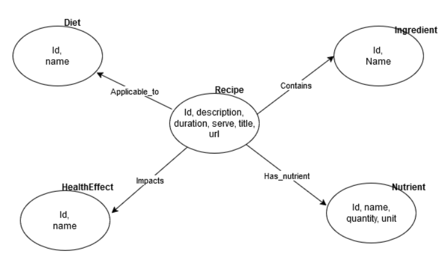

# DataEng 2024 Template Repository

Project [DATA Engineering](https://www.riccardotommasini.com/courses/dataeng-insa-ot/) is provided by [INSA Lyon](https://www.insa-lyon.fr/).

Students: **Seynabou SARR, Roua BOUSLIMI**

## Abstract

Our project aims to recommend healthy recipes according to their benefits and effects on different parts of the body. We also want to include ingredient availability and diet. Here are the different questions we'd like our database to answer:

1: Which recipes are best for specific health objectives (e.g. improving digestion)?

2: Which recipes are suitable for specific diets (e.g. vegetarian, vegan, gluten-free)?

## Datasets
1-	Hummus Data : https://gitlab.com/felix134/connected-recipe-data-set 

2-	Spooncular : https://spoonacular.com/food-api

## Project steps
### Ingestion

We retrieved a dataset from a previous study of recipes carried out by a team at INSA: Hummus data. This dataset contains details of recipes scrapped from food.com, along with author data and review ratings. We've added a few recipes from the spooncular api. The ingestion step is fairly simple. It consists of : 
- A curl request to retrieve Hummus data from gitlab and store it in a csv file.
- The retrieval of 300 recipes from spooncular with diets and a filter on the request to get only healthy recipes.

For this ingestion part, we chose to persist our data in csv format.

### Wrangling
Hummus data came with authors information and review we don't wanted to use. So we removed columns related to them. We had also to sample because of the large amount of data about 590 000 rows and sampling is done among recipes having 'A' or 'B' as nutriscore value. After that we had to add diets information. Diets are affected to a recipe using keywords in ingredients list.

Another part of our project was to link recipes with some body objectives. To do so, we tried to categorize them usings amount of nutrients within recipes. We used some recommendations of macro-nutrient proportions per day and per meal. The calculation approach is generalized and doesn't include detailed factors such as age, height, weight, activity level, and overall health.
- Calories : Moderately active average a day for men 2600 and women 2000. A meal is 25% of recommended daily intake
- Fats : less than or equal to 30% of meal calories
- Saturated Fats : less than 10% of meal calories
- Carbohydrates : 55% of meal calories
- Fiber : at least 8g per meal, based on 30g per day
- Proteins : 15-20% of meal calories
- Sodium : less than 600mg per meal, based on 2400mg per day

Finally we store our data on mongoDB collection.

### Production
We construct a graph DB using neo4j and according to this schema.

### Requirements
You need docker installed in your computer.

Required libraries are inclued in the .env file

## How to run
In the root folder of the project where is located the docker-compose.yaml file, run "docker compose up -d --build" or "docker-compose up -d --build if you have an older version of Docker.
- "-d" is to run in background and free the terminal
- "--build" is to build the solution, useful for the first run or when you make changes in config

## Analytics
We provide a notebook on the ./notebooks folder to give an overview our database features.

## Improvements

Here are a few ideas for improvement

- The approach to determine diet using keywords is something we could do better. For Hummus dataset, since we knew in which website they came from and we noticed that recipes there were classed using diet, we could do further scrapping to complete hummus data with diet column.

- Also, a collaboration with a nutrition laboratory can help obtain a more exhaustive list of health Effects. And a work of training a machine learning model can be considered to determine the recipe's effects on health and the body.

- In the same way, with more data, a model could go further by proposing recipes that it has composed itself.